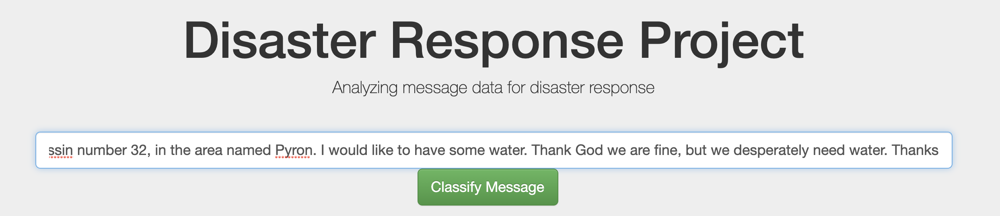
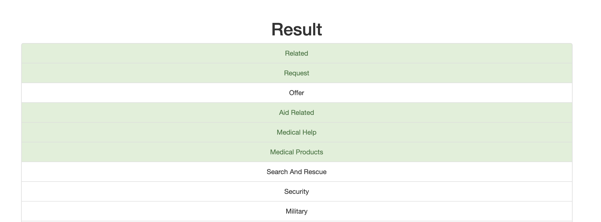

## Analyzing message data for disaster response

The objective of this project is to analyze data from Figure Eight to build a model for an API that classifies disaster messages base on some related categories, eg. food, water, shelter, clothing, etc.

## Libraries used

To run the associated python scripts and flask API please ensure your python environment contains the following libraries:

- plotly
- flask
- scikit-learn
- nltk
- pandas==1.2.3
- SQLAlchemy

## How to run the scripts

The following is the directory structure of the project:

```sh
disaster-response
├── app
│   ├── run.py
│   └── templates
│       ├── go.html
│       └── master.html
├── data
│   ├── categories.csv
│   ├── database.db
│   ├── messages.csv
│   └── process_data.py
└── models
    ├── classifier.pkl
    └── train_classifier.py
```

### 1. Create the data base

The data is inside the data directory, it is in raw format inside two csv files, messages and categories. The first step is to create the SQL Lite data base.
In order to create the data base run the below command inside the data directory
```sh
python process_data.py messages.csv categories.csv database.db
```
As you can see the the parameters are the messages file, the categories file and finally the database name you want.

### 2. Create the model

Once you have create the database the second step is to train a model. I have used a decision tree regressor DecisionTreeRegressor which will allow multiclass output given that I am trying 
to predict on 36 different classes from each message.

The process to create the model will use a Pipeline and a Grid Search in order to find the best parameters for the model. The model will be saved in the classifier.pkl file in the models directory.

In order to create the model run the below command inside the models directory
```sh
python train_classifier.py classifier.pkl
```
In this case the only paramenter needed is the name of the output file with the model.

### 3. Run the API

Now that you have the model, it is time tu run the API.  The API will allow you to enter messages and see the different categories that messages fit:



When you hit the Classify Message button, you will see the different categories hightlited in green.



In order to run the API, do the following inside the app directory
```sh
python run.py
```

Then you can open your browser and go to http://127.0.0.1:3001

## License

The content of this repository is licensed under a [Creative Commons Attribution License](http://creativecommons.org/licenses/by/3.0/us/)
